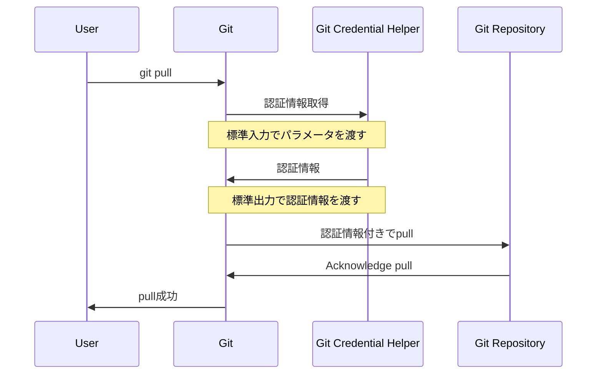
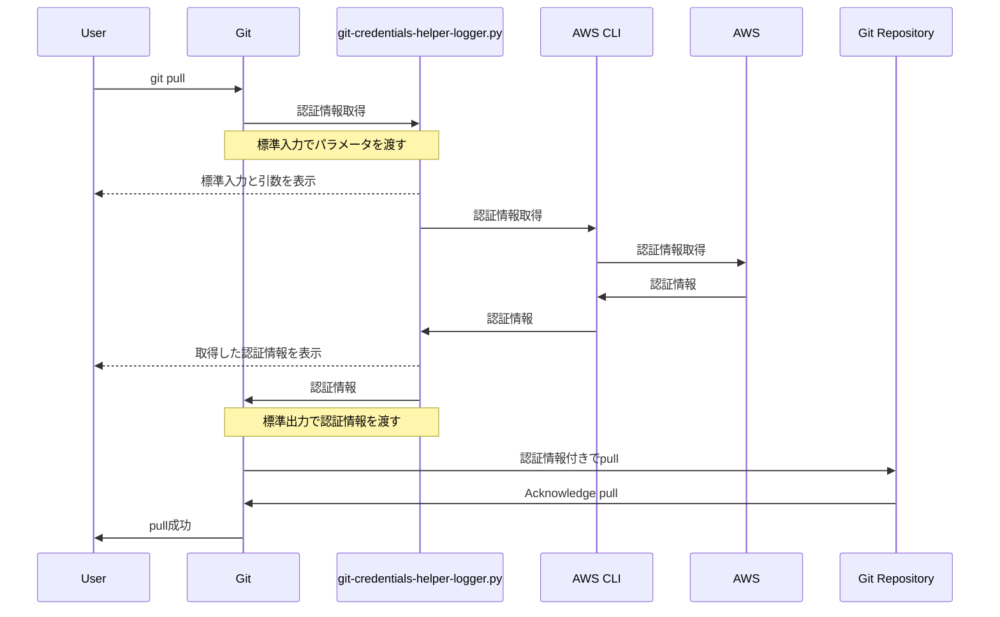

AWS CodeCommitをGitレポジトリとして使用した場合、[AWS CodeCommitドキュメント](https://docs.aws.amazon.com/ja_jp/codecommit/latest/userguide/setting-up-https-unixes.html)
に書かれている通り、下記の手順でCodeCommitのレポジトリへアクセス認証情報を設定することができる。

```
git config --global credential.helper '!aws codecommit credential-helper $@'
git config --global credential.UseHttpPath true
```

この設定がある状態で、`git push`や`git pull`などを実行すると、AWS CLIのコマンド`aws codecommit credential-helper $@`が実行される認識だったが、このコマンドがGitとどのように認証情報をやり取りしているのかわかっていなかったので、やり取りされている情報ををダンプするスクリプトを作成して、その内容を確認した。

## GitとGit Credential Helper間の入出力

GitとGit Credential Helper間のやりとりは標準入力と標準出力上で行われていて、Git　Credential Helper側では標準入力でGitからの入力を受け取り、結果の認証情報を標準出力から出力するという処理を行う。
例えば,`git pull`を実行したときの処理の流れは以下の図のようになる。



### Git Credential Helperのコマンド

GitからCredential Helperへ渡されるコマンドが3つあり、それぞれ以下の意味になる。

| コマンド | 説明                                                        |
| :------- | :---------------------------------------------------------- |
| get      | ユーザとパスワードを取得する                                |
| store    | 認証情報をCredential Helperの記憶領域に保存する（出力なし） |
| erase    | 保存された認証情報を消去する（出力なし）                    |

### 入出力情報のフォーマット

入出力はキーバリューのペアで表現されて、`<key>=<value>`で一つのペアになり、各ペアは改行で区切られている。キーが`[]`で終わっている場合は、複数の値をとることができる。[^1]

[^1]: [INPUT/OUTPUT FORMAT](https://git-scm.com/docs/git-credential#IOFMT)

```text
// 例
protocol=https
host=codecommit.amazonaws.com
```

## 入出力をダンプするスクリプトを作る

スクリプトはGitとAWS CLIの間に入って、入出力を画面に表示するようにする。
スクリプトの名前を `git-credentials-helper-logger.py` とすると、処理の流れはこのようになる。



(mermaidの図が小さいかも)

以下のように、Pythonを使ってスクリプトを作った。

@[gist](https://gist.github.com/r-tamura/4991c6f6669dc9da2a76c9b93902c9f7)

やっていることの概要はこんな感じ。

1. 標準入力に渡されたGitからの入力を画面に表示
2. コマンド引数として渡されたコマンドを画面に表示
3. AWS CLIに上記入力値とコマンドをそのまま渡して呼び出し、認証情報を取得
4. 取得できた認証情報を画面に表示
5. 取得できた認証情報を標準出力経由でGitに返す

ここで、「画面に表示」のところは標準エラーに出力している（標準出力だとGitがCredential Helperの出力として扱ってしまうため）。

## 入出力内容を確認してみる

動作確認に必要なツール

- Git
- AWS CLI
- Python

さっき作ったスクリプトをCredential Helperとして、Gitの設定ファイルに登録する。

```text
[credential]
  helper = !python <ファイルを置いたディレクトリ>/git-credentials-helper.py
```

この状態で`git pull`を実行してみた結果が以下になった。

```
❯ git pull
====== credential-helper input =====
protocol=https
host=git-codecommit.<AWSリージョン>.amazonaws.com
path=v1/repos/<レポジトリ名>
wwwauth[]=Basic realm=""

====================================
====== args =====
['<ファイルを置いたディレクトリ>/git-credential-helper-logger.py', 'get']
=================
====== credential-helper output =====
username=AS...略
password=20...略

====================================


====== credential-helper input =====
protocol=https
host=git-codecommit.<AWSリージョン>.amazonaws.com
path=v1/repos/<レポジトリ名>
username=AS...略
password=20...略
====================================
====== args =====
['<ファイルを置いたディレクトリ>/git-credential-helper-logger.py', 'store']
=================
====== credential-helper output =====

====================================


Already up to date.
```

ここで、AWS CLIが返したusername,passwordは長い文字列だったが、省略している（_...略_ と表記しているところ)

出力された結果を見てみると

- 'get'と'store'のコマンドがそれぞれ呼ばれている
- 'get'のとき、Gitからはレポジトリの情報(host, path等)が渡され、AWS CLIはGitにusernameとpasswordを返している
  - おそらく、AWS CLIは設定されたクレデンシャルでAWSのサービス（CodeCommit?）にと問い合わせてレポジトリの認証情報を取得している
- Gitから認証情報をを'store'するようにコマンドが発行されているが、AWS CLIが実際にどこかに保存しているかはわからない

## まとめ

- GitとGit Credential Helper(AWS CLI)間でやり取りされている情報やフォーマットを確認することができた。
- usernameとpasswordを標準出力に返せればよいので、必要な場合はCredential Helperを自作することもそこまで難しくなさそうだということがわかった。

# おまけ: デフォルトのGit Credential Helper

特に何も設定しない場合に、Gitの認証情報がどう扱われるかはOSごとに異なる。[^2]

- macOSではキーチェーンに保存される
- WindowsではGit for WindowsをインストールするとGit Credential Managerが有効化される

[^2]: [Credential Storage](https://git-scm.com/book/en/v2/Git-Tools-Credential-Storage#:~:text=your%20home%20directory.-,If%20you%E2%80%99re%20using%20macOS,Instructions%20for%20more%20information.,-You%20can%20choose)

## 参考

- [7.14 Git Tools - Credential Storage](https://git-scm.com/book/en/v2/Git-Tools-Credential-Storage)
- [gitcredentials | CUSTOM HELPERS](https://git-scm.com/docs/gitcredentials#_custom_helpers)
- [gitのcredential helperを自作してみる](https://qiita.com/odayushin/items/032aa0ee32de43d52bf1)
